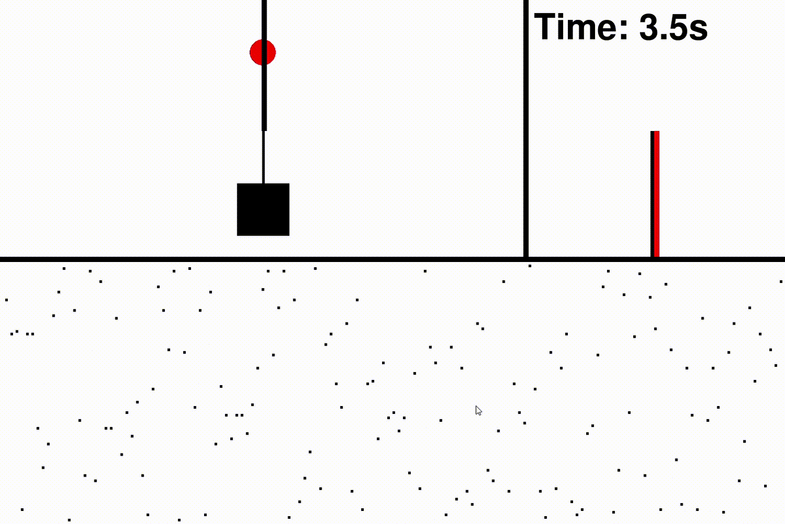

# Closed-form control with spike coding networks
This work was developed by F. Slijkhuis, supervised by S. Keemink and P. Lanillos as part of the SPIKEFERENCE project, co-founded by the Human Brain Project (HBP) Specific Grant Agreement 3 (ID: 945539) and the Donders Institute for Brain, Cognition and Behaviour.

### Citation
Slijkhuis, F. S., Keemink, S. W.*, & Lanillos, P.* (2023). Closed-form control with spike coding networks. IEEE Tran. Cog. Dev. Sys. SI Advancing AI with neuromorphic computing.
### Paper
- https://ieeexplore.ieee.org/stamp/stamp.jsp?arnumber=10266764
- https://arxiv.org/abs/2212.12887

### Description
We develop the Spiking Coding Network theory for estimation and control. The resulting networks work as a spiking equivalent of a linear–quadratic–Gaussian
controller. We demonstrate robust spiking control of simulated spring-mass-damper and cart-pole systems, in the face of several perturbations, including input- and system-noise, system disturbances, and neural silencing. As our approach does not need learning or optimization, it offers opportunities for deploying fast and efficient task-specific on-chip spiking controllers with biologically realistic activity.

### Results
#### Spring-mass-Dumper System (SMD)
(A) SMD, (B) Estimation of the SMD and (C) Control of the SMD and study of robustness against neural silencing.

#### Cartpole
(A) Cartpole model, (B) Estimation and Control with a step function as reference (Spiking LQG)

#### Animation
### Author: André Rodrigues Urbano

## Funding
 

